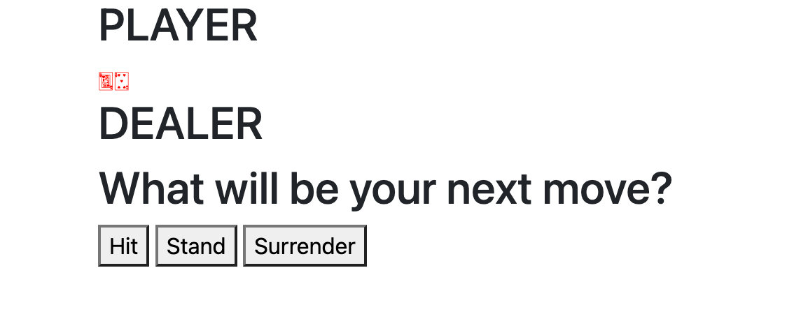
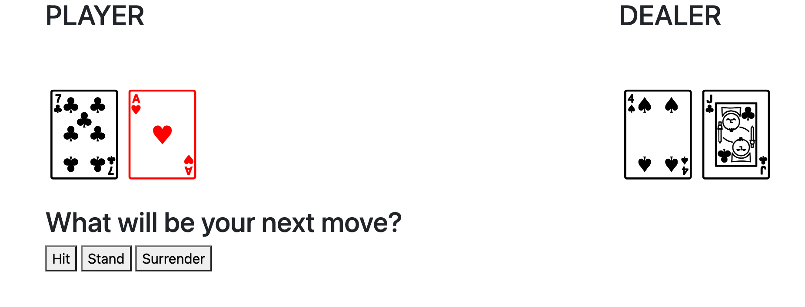

# Blackjack/Veintiuna PHP game
BeCode learning challenge, working with PHP classes

## Another monday
Let's start of this grayish monday at the end of June with some good old Blackjack.
For this challenge we need to make the game with PHP, fun, fun, fun. Time to learn more about PHP and start working with
those classes. I like to start off my monday with some Wikipedia HISTORY.

### What is Blackjack?
Blackjack (formerly Black Jack and Vingt-Un) is a casino banking game. It is the most widely played casino banking game in
the world, it uses decks of 52 cards and descends from a global family of casino banking games known as [Twenty-One](https://en.wikipedia.org/wiki/Twenty-One_(banking_game)).
Blackjack players do not compete against each other. The game is a comparing card game where each player competes against the dealer.

### Just a little History
The immediate precursor of Blackjack was the English version of twenty-one called Vingt-Un, a game of unknown (but probably Spanish) provenance.
The first written reference is found in a book by the Spanish author [Miguel de Cervantes](https://en.wikipedia.org/wiki/Miguel_de_Cervantes).
Cervantes was a [gambler](https://en.wikipedia.org/wiki/Gambling), and the protagonists of his "[Rinconete y Cortadillo](https://en.wikipedia.org/wiki/Rinconete_y_Cortadillo)", from [Novelas Ejemplares](https://en.wikipedia.org/wiki/Novelas_ejemplares), are card cheats in [Seville](https://en.wikipedia.org/wiki/Seville). 
They are proficient at cheating at veintiuna (Spanish for "twenty-one") and state that the object of the game is to reach 
21 points without going over and that the [ace](https://en.wikipedia.org/wiki/Ace) values 1 or 11. The game is played with the Spanish [baraja](https://en.wikipedia.org/wiki/Spanish-suited_playing_cards) deck.

"Rinconete y Cortadillo" was written between 1601 and 1602, implying that ventiuna was played in [Castile](https://en.wikipedia.org/wiki/Kingdom_of_Castile) since 
the beginning of the 17th century or earlier. Later references to this game are found in France and Spain.

I could still go on but I think we can conclude it's a very old card game.

### The rules we will play by
1. Cards are between 1-11 points.
   1. Faces ([belekes](http://www.antwerps.be/woord/2095)) are worth 10
   2. Ace (**nen aas**) is always worth 11
2. Getting more than 21 points means that you lose.
3. To win you need to have more points than the dealer, but not more than 21.
4. The dealer is obligated to keep taking cards until he has at least 15 points.
5. We are not playing with Blackjack rules on the first turn (having 21 on first turn), we leave this up to you as a nice to have.

****

We have done some **OOP** exercises last week, but let's take our first dive into **object oriented programming**.

## The diving mission

Our diving instructors have provided us with some starter classes that we can use for the game, and to help us out on our 
first **OOP dive**. Let's first spent some time reading these classes and really understand what they are doing. When something 
is unclear we take of our diving goggles and do some googling first, if it is still unclear we can go to our diving instructors 
for some more clarity. Reminder: don't feel bad, it's normal that this will feel difficult, **OOP** is a really complex subject.

### The 'flow' of the game
1. A new deck is shuffled.
2. Player and dealer get 2 **random** cards.
3. The dealer shows the first card he drew to the player.
4. The player either keeps getting hit (asks for more cards), or stands down.
5. If the player at any point goes above 21, he automatically loses.
6. Once the player is done the dealer keeps taking cards until he has at least 15 points. If the dealer hits above 21 he automatically loses.
7. At the end, display the winner.

### Instructions for the dive

#### Take a dive to about 10 meters and create the base classes
1. -[x] Create a class called `Player` in the file `Player.php`.
```php
<?php

declare(strict_types=1);

class Player
{

}
```
2. Add 2 private properties (inside our class):
   - [x] `cards` (array)
   - [x] `lost` (bool, default = false)
```php
private array $cards;
private bool $lost;
```
3. Add a couple of empty public methods to this class:
   - [x] `hit`
   - [x] `surrender`
   - [x] `getScore`
   - [x] `hasLost`
```php
public function hit() {

}
    
public function surrender() {

}
    
public function getScore() {
        
}
    
public function hasLost() {
        
}
```

4. -[x] Create a class called `Blackjack` in the file `Blackjack.php`.
```php
<?php

declare(strict_types=1);

class Blackjack
{

}
```
5. Add 3 private properties:
  - [x] `player` (Player)
  - [x] `dealer` (Player for now)
  - [x] `deck` (Deck)
```php
private Player $player;
private Player $dealer;
private Deck $deck;
```
6. Add the following public methods:
   - [x] `getPlayer` (returns the `player` object)
   - [x] `getDealer` (returns the `dealer` object)
   - [x] `getDeck` (returns the `deck` object)
```php
/**
* @return Player
*/
public function getPlayer(): Player
{
    return $this->player;
}

/**
* @return Player
*/
public function getDealer(): Player
{
    return $this->dealer;
}

/**
* @return Deck
*/
public function getDeck(): Deck
{
    return $this->deck;
}
```
7. In the [constructor](https://www.php.net/manual/en/language.oop5.decon.php) do the following:
   - [x] Instantiate the Player class twice, insert it into the `player` property and a `dealer` property.
   - [x] Create a new `deck` object (the code has already been written for us!).
   - [x] Shuffle the cards with our `shuffle` method on `deck`.
    ```php
    public function __construct()
    {
    $this->player = new Player();
    $this->dealer = new Player();
    $this->deck = new Deck();
    $this->deck->shuffle();
    }
    ```
8. In the [constructor](https://www.php.net/manual/en/language.oop5.decon.php) of the `Player` class:
   - [x] Make it expect the `Deck` object as a parameter.
      ```php
       public function __construct(Deck $deck)
       {
          $this->lost = false;
          $this->cards = [];
       }
      ```
   - [x] Pass this `Deck` from the `Blackjack` constructor.
     ```php
     $this->player = new Player($this->deck);
     $this->dealer = new Player($this->deck);
     ```
  - I'm not entirely sure about this one, the steps are kind of confusing me because it also says that at these steps we are working in the Player class constructor... But then again it says "pass this deck from the blackjack constructor". Still having some issues with terminology in English. 

  - [x] Draw 2 cards for the player. You have to use an existing method for this from the `Deck` class.
     ```php
     public function __construct(Deck $deck)
     {
        $this->lost = false;
        $this->cards = [];
        for ($i=0; $i<2; $i++) {
            $this->cards[] = $deck->drawCard();
        }
     }
     ```
9. Go back to the `Player` class and add the following logic in your empty methods:
   - [x] `getScore` loops over all the cards and returns the total value of that player.
     ```php
     public function getScore(array $cards) : int {
       $score = 0;
       foreach ($this->cards as $card){
           $score += $card->getValue();
       }
       return $score;
     }
     ```
   - [x] `hasLost` will return the bool of the lost property.
     ```php
     public function hasLost() : bool {
       return $this->lost;
     }
     ```
   - [x] `hit` should add a card to the player. If this brings him above 21, set the `lost` property to `true`. To count his score use the method `getScore` you wrote earlier. This method should expect the `$deck` variable as an argument from outside, to draw the card.
     ```php
     public function hit(Deck $deck) : void {
       $this->cards[] += $deck->drawCard();
       if ($this->getScore($this->cards) > 21){
           $this->lost = true;
       }
     }
     ```
     - [ ] (**optional**) For bonus points make the number 21 a class constant: this is a [magical value](https://stackoverflow.com/questions/47882/what-is-a-magic-number-and-why-is-it-bad) we want to avoid.
   - [x] `surrender` should make you surrender the game (The dealer wins). This sets the property `lost` in the `player` instance to true.
     ```php
     public function surrender() : bool {
         return $this->lost = true;
     }
     ```
   - [x] `stand` does not have a method in the player class but will instead call hit on the `dealer` instance. (You have to do nothing here.)

#### Dive a little deeper to 12 meters and create the index.php file
- Create an `index.php` file with the following code:
  - [x] Require all the files with the classes you already created. Ideally you want a **separate file** for each class.
    ```php
    <?php
    declare(strict_types=1);
    
    require 'code/Blackjack.php';
    require 'code/Card.php';
    require 'code/Deck.php';
    require 'code/Player.php';
    require 'code/Suit.php';
    ```
  - [x] Start the PHP session.
  - An important thing about the `session_start()` function is that it must be called at the beginning of the script, before any output is sent to the browser. Otherwise, you'll encounter the infamous `Headers are already sent` error.
    ```php
    session_start();
    ```
  - If the session does not have a `Blackjack` variable yet:
    - [x] Create a new `Blackjack` object.
    - [x] Put the `Blackjack` object in the session.
    ```php
    $blackjack = new Blackjack();
    $_SESSION['blackjack'] = $blackjack;
    ```
- [x] Use buttons or links to send to the `index.php` page what the player's action is (i.e. hit/stand/surrender).
    ```php
    <div>
        <form method="post">
            <h2>What will be your next move?</h2>
            <button type="submit" name="hit" value="hit">Hit</button>
            <button type="submit" name="stand" value="stand">Stand</button>
            <button type="submit" name="surrender" value="surrender">Surrender</button>
        </form>
    </div>
    ```

Normally everything we needed to do for the player should be done at this depth. Take a moment to enjoy the view at this depth, take it all in.

#### Let's dive to a depth of 15 meters and take a look at the dealer
At this moment we still have the same rules for the player and the dealer, but there is an important difference.
The dealer keeps playing with the `hit` function until he has **at least** 15. So how will we fix this at our current depth:
- To change this behaviour:
  - [x] We are going to [extend](https://www.php.net/manual/en/language.oop5.inheritance.php) the `player` class and extend it to a newly created `dealer` class.
    ```php
    class Dealer extends Player {
    
    }
    ```
  - [x] Change the `Blackjack` class to create a new `dealer` object instead of a `player` object for the property of the dealer.
    ```php
    private Player $player;
    private Dealer $dealer;
    private Deck $deck;

    public function __construct()
    {
        $this->deck = new Deck();
        $this->deck->shuffle();
        $this->player = new Player($this->deck);
        $this->dealer = new Dealer($this->deck);
    }
    ```
  - [x] Create a `hit` function that keeps drawing cards until the dealer has **at least** 15 points. Watch out at these depths, because there are tricky parts. We also need the `lost` check we already had in the `hit` function of the player. We could just dive up to it and copy the code, but this is never the solution. But if we take a good look around at this depth there is a chance we will spot a "Parrot fish" and on his sides you will find `parent::hit();`, we can then use this piece of code to call the old `hit` function.
    ```php
    public function hit(Deck $deck): void
    {
        if($this->getScore()<15) {
            parent::hit($deck);
        }
    }
    ```
I think this will do the trick for our dealer, let's go on to the next steps!

#### Let's go for the final push and dive to 18 meters
Now that all our classes are ready we just need to keep breathing calmly, we don't want to run out of oxygen at this depth.
The only thing we need to do now is write some minimal glue in the `index.php`. We can try and find a `sandcastle worm' for some extra sticky underwater glue.

First let's add some bootstrap, this will help us for the styling of the game. So under the <title> tag, in our <head> we add:
```html
<link href="https://cdn.jsdelivr.net/npm/bootstrap@5.2.0-beta1/dist/css/bootstrap.min.css" rel="stylesheet" integrity="sha384-0evHe/X+R7YkIZDRvuzKMRqM+OrBnVFBL6DOitfPri4tjfHxaWutUpFmBp4vmVor" crossorigin="anonymous">
```

And at the bottom before our </body> closing tage we add:
```html
<script src="https://cdn.jsdelivr.net/npm/bootstrap@5.2.0-beta1/dist/js/bootstrap.bundle.min.js" integrity="sha384-pprn3073KE6tl6bjs2QrFaJGz5/SUsLqktiwsUTF55Jfv3qYSDhgCecCxMW52nD2" crossorigin="anonymous"></script>
```

I actually want to see how I can see the cards for the player and the dealer. Here I think I still need to get these, so I will make a getter for the cards in the Player class.
```php
/**
* @return array
*/
public function getCards(): array
{
    return $this->cards;
}
```

Now in my index.php if is say:
```php
<?php
foreach($_SESSION['blackjack']->getPlayer()->getCards() AS $card) {
    echo $card->getUnicodeCharacter(true);
}
?>
```

I get the players cards so I can also do this for the dealer, but I still see that the cards are very, very, very tiny. So I need to fix this too, let's see what else we can do with the foreach syntax in php.
I found some alternative ways to write control structures in php [here](https://www.php.net/manual/en/control-structures.alternative-syntax.php#:~:text=PHP%20offers%20an%20alternative%20syntax,%2C%20or%20endswitch%3B%20%2C%20respectively.).
In the end I figured out I don't really need to use them, I just did the following to enlarge the cards (see code underneath) and I also added the cards for the dealer. For that we had to change `getPlayer()` to `getDealer()`.
```php
echo '<span style="font-size: 8rem">' . $card->getUnicodeCharacter(true) . '</span>';
```


The final result we want should be the following:

- [ ] When we click the hit button, call `hit` on the player, then check the lost status of the player. We need to pass a `Deck` variable to this function, we can use the `Blackjack::getDeck()` method for this.
- [ ] When we click the stand button, call `hit` on the dealer, then check the lost status of the dealer. If he is not lost, compare scores to set the winner (if it's equal the house always wins).
- [ ] If we click surrender, the dealer automatically wins.
- [ ] On the page we always want to display the scores of both players.
- [ ] If there is a winner, display it.
- [ ] End of the game, destroy the current `blackjack` variable so the game restarts.

### For the Advanced Open Water SCUBA Divers these are nice to have
- Implement an underwater betting system
  - [ ] Every new diver (player) (new session) starts with 100 🐚 shells.
  - [ ] After the diver gets his 2 first cards, every round, ask how much he wants to bet. He needs to bet at least 5 🐚 shells.
  - [ ] If the diver wins the bet he gains double the amount of 🐚 shells.
- Implement the blackjack first turn rule:
  - [ ] If the diver draws 21 the first turn: he directly wins.
  - [ ] If Neptune (dealer) draws 21 the first turn, he wins.
  - [ ] If both draw 21, it is a tie.
  - When you implement these nice to have features:
    - [ ] A blackjack means an auto win of 10 🐚 shells.
    - [ ] A blackjack for Neptune, a loss of 5 🐚 shells for the diver.

## Some diving TIPS
- Be sure to check the pre made classes and the `example.php` file. This file shows how you can easily get some graphical presentation for the cards to spice up your game during the dive.
- Try to avoid referring to `$_SESSION` inside your objects, because this breaks [encapsulation](https://en.wikipedia.org/wiki/Encapsulation_(computer_programming)). If you need it, pass it as an argument.
- Stuck? Check the FAQ that is included in the repo for some of the most common problems.


## Let's dive in 🤿